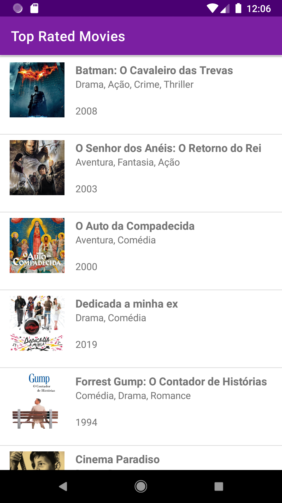

<h1 align="center">
  Best Movies
</h1>

<p align="center">
  <a href="#rocket-project">Project</a>&nbsp;&nbsp;&nbsp;|&nbsp;&nbsp;&nbsp;
  <a href="#computer-technologies">Technologies</a>&nbsp;&nbsp;&nbsp;|&nbsp;&nbsp;&nbsp;
  <a href="#thinking-how-to-use">How to use?</a>&nbsp;&nbsp;&nbsp;|&nbsp;&nbsp;&nbsp;
  <a href="#memo-license">License</a>
</p>

## :rocket: Project

:globe_with_meridians:
Project developed using api https://developers.themoviedb.org

## Preview

<div style="display: flex">


</div>

## :computer: Technologies

- [Android](https://www.android.com/intl/pt-BR_br/)
- [Kotlin](https://kotlinlang.org/)
- [MVVM](https://blog.mindorks.com/mvvm-architecture-android-tutorial-for-beginners-step-by-step-guide)

## :thinking: How to use?

```sh
Open project in Android Studio
```

```sh
Click on "Run App" or "Shift + F10"
```

## :memo: License

MIT
